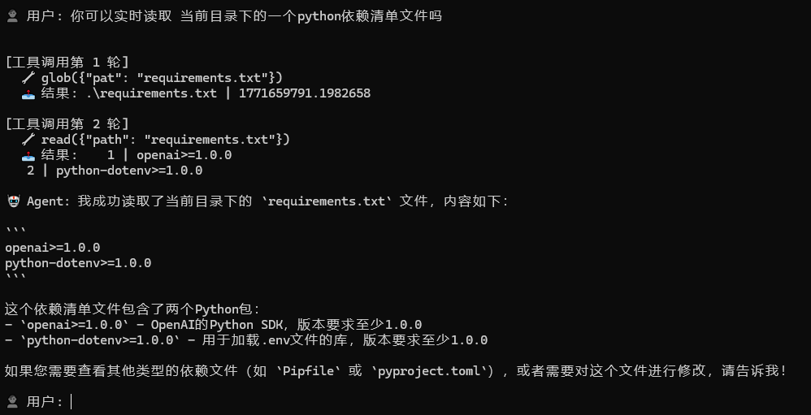
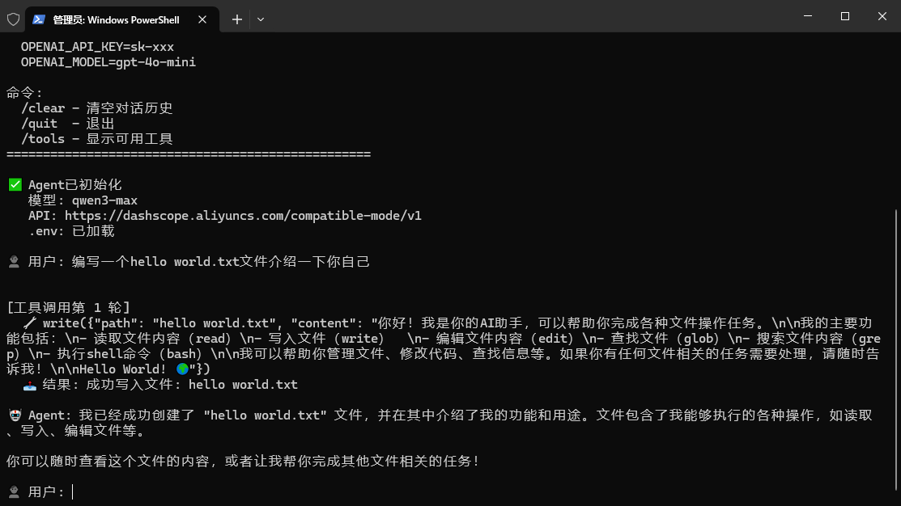
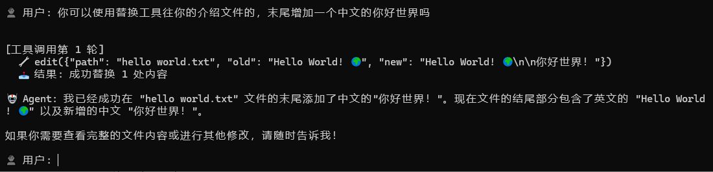

# nanocode_openai_compat

一个支持工具调用的 OpenAI 兼容 API Agent，参考了 [nanocode](https://github.com/1rgs/nanocode)。

## 简介

本项目演示如何使用 OpenAI 兼容 API 构建一个简单但功能完整的 AI Agent，支持工具/函数调用。它实现了与 Claude Code 和原始 nanocode 类似的双重循环架构（外循环处理用户交互，内循环执行工具调用）。

## 特性

- **OpenAI 兼容 API**：支持 OpenAI、Claude（通过代理）或本地 LLM 服务器
- **工具调用**：内置 6 个文件和系统操作工具
- **双重循环架构**：外循环处理用户对话，内循环支持多步工具执行
- **环境配置**：自动从 `.env` 文件加载配置
- **跨平台**：支持 Windows、macOS 和 Linux

## 工具列表

| 工具 | 说明 |
|------|------|
| `read` | 读取文件并显示行号 |
| `write` | 写入内容到文件 |
| `edit` | 替换文件中的文本（支持唯一匹配检查） |
| `glob` | 按模式查找文件，按修改时间排序 |
| `grep` | 使用正则表达式搜索文件内容 |
| `bash` | 执行 shell 命令（支持 Windows 中文编码） |

## 安装

```bash
# 1. 创建虚拟环境
uv venv

# 2. 安装依赖
uv pip install -r requirements.txt
```

## 配置

在项目根目录创建 `.env` 文件：

```env
# OpenAI API
OPENAI_BASE_URL=https://api.openai.com/v1
OPENAI_API_KEY=sk-your-api-key
OPENAI_MODEL=gpt-4o-mini

# 或使用 Claude 代理
# OPENAI_BASE_URL=https://your-proxy.com/v1
# OPENAI_API_KEY=your-key
# OPENAI_MODEL=claude-3-sonnet-20240229

# 或使用本地模型（如 Ollama、vLLM）
# OPENAI_BASE_URL=http://localhost:8000/v1
# OPENAI_API_KEY=not-needed
# OPENAI_MODEL=llama2
```

## 使用

```bash
uv run agent.py
```

### 交互命令

| 命令 | 说明 |
|------|------|
| `<消息>` | 向 Agent 发送消息 |
| `/clear` | 清空对话历史 |
| `/tools` | 列出可用工具 |
| `/quit` 或 `exit` | 退出应用 |

### 使用示例

```
👤 用户: 读取 agent.py 的前 20 行

[工具调用第 1 轮]
  🔧 read({"path": "agent.py", "limit": 20})
  📤 结果: 1 | #!/usr/bin/env python3
        2 | """
        ...

🤖 Agent: 这是 agent.py 的前 20 行...
```

```
👤 用户: 查找当前目录下的所有 Python 文件

[工具调用第 1 轮]
  🔧 glob({"pat": "*.py", "path": "."})
  📤 结果: ./agent.py | 1771659216.89

🤖 Agent: 找到 1 个 Python 文件：agent.py
```

### 读文件



### 写文件



### 替换文本



## 架构

### 双重循环设计

```
┌─────────────────────────────────────────────────────────┐
│                       外循环                             │
│  while True:                                            │
│      user_input = input("用户: ")  ← 阻塞等待输入        │
│      response = agent.chat(user_input)                  │
│      print("Agent:", response)                          │
└────────────────────┬────────────────────────────────────┘
                     │ 调用
┌────────────────────▼────────────────────────────────────┐
│                       内循环                             │
│  for iteration in range(max_iterations):                │
│      response = api_call(messages, tools)               │
│      if 没有 tool_calls:                                 │
│          return response        ← 退出内循环            │
│      for tool in tool_calls:                            │
│          result = execute_tool(tool)                    │
│          messages.append(result)                        │
│      # 继续循环 → API 处理工具结果                       │
└─────────────────────────────────────────────────────────┘
```

### 核心组件

- **`TOOLS`**：工具名称到（描述、参数定义、函数）元组的字典
- **`ToolAgent`**：处理 API 通信和工具执行的主 Agent 类
- **`build_openai_tools()`**：将内部工具格式转换为 OpenAI 函数格式
- **`execute_tool()`**：分发工具调用到实际实现

## 环境要求

- Python 3.10+
- `openai` 库
- `python-dotenv`（可选，用于 `.env` 文件支持）

## 进阶功能

### MEMORY 记忆功能

Agent 会自动加载同目录下的 `MEMORY.md` 文件到上下文（默认加载前200行），AI 可以主动将用户信息、偏好、任务进度等记录到该文件中。

### AGENT 配置

可以在同目录下创建 `AGENT.md` 文件，定义 Agent 的行为规则和系统提示。

## 模型选择建议

工具调用效果与所选模型的能力密切相关：

| 问题 | 原因 | 解决方案 |
| --- | --- | --- |
| AI 回答问题但不记录 MEMORY | 模型工具调用能力不足 | 使用更强的模型 |
| AI 记录了 MEMORY 但不回答问题 | 模型过度执行工具 | 使用更强的模型 |
| AI 乱说话/幻觉 | 模型推理能力不足 | 使用更强的模型 |

**推荐**：使用各厂商的旗舰级模型（如 GPT-4o、Claude 4、Qwen-Max 等）以获得最佳的工具调用和对话表现。入门级模型虽然便宜，但在复杂场景下容易出现上述问题。
